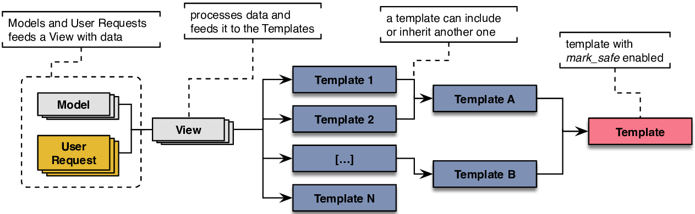

### Motivation

Pythia was made after conducting several penetration tests for Django applications. 
During that time some of this work's tasks ended up being tedious and repetitive
such as `grep-ing` for several keywords (e.g. mark_safe, csrf_exempt)
in order to find certain issues.
This tool aims to eliminate most of the repetitive tasks.

This issue is amplified when a security engineer attempts to find XSS vulnerabilities
in Django applications while templates are being used. Templates support inheritance,
meaning that a template can `extend` or `include` another template. Now let's say
we find that a specific template renders _unsanitized_ output, potentially coming from
the user. In that case, we have no way of knowing which templates render the one
mentioned above. The image below depicts the issue.

## Design Decisions

Pythia makes use of Django's runtime for specific tasks:  
1. Resolve URLs to their corresponding views  
2. Parse templates using Django's Template class and produce its AST (Abstract Syntax Tree)

Other tools (e.g. [PyT](https://github.com/python-security/pyt)) have chosen to take the purely
static analysis approach that is convenient because we can run such
tools just by cloning the application's repository without any other
dependencies. On the other hand, this approach cannot explore paths
that require the Django's runtime to be set up. For example, in order to
compile a template, due Django's templates' extensibility, Django needs to
know where a custom tag or filter is defined so that it can produce
the template's AST.

